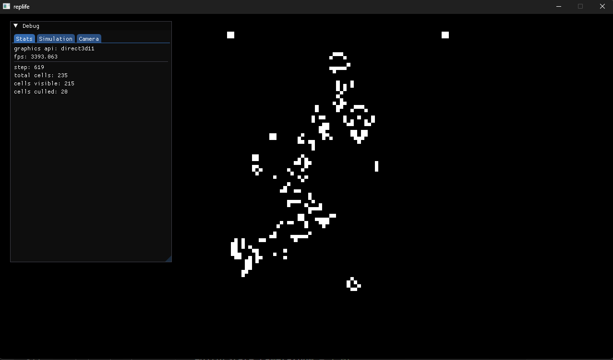

# a simple and optimized conway's game of life simulator written in c++

## Features:
- infinite canvas
- rle parser (import patterns encoded in rle)
- memory efficient (stores only active cells)
- multithreading (worker thread calculates the next step, while main thread updates the game state and renders)
- batched rendered

## Todo:
- editor mode (let you edit initial state visually)
- time control (move steps back and forth)

## Dependencies:
- SDL3
- imgui

## How To Build?
build the CMake target (replife) in the root.